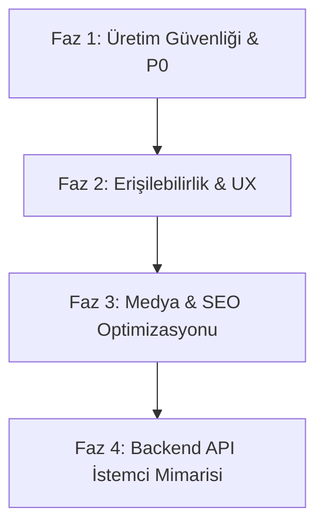

# Düğünajansım Frontend Uçtan Uca Analiz ve Çözüm Planı Raporu

**Tarih:** 27 Temmuz 2026  
**Kapsam:** `index.html`, `login.html`, `paketini-olustur.html`, yasal sayfalar (`kvkk-aydinlatma.html`, `gizlilik-politikasi.html`, `kullanim-sartlari.html`), CSS & JS modülleri, Playwright e2e testleri, linter'lar ve varlıklar.  
**Değerlendirme Yöntemi:** Statik kod denetimi, otomatik testler (Playwright + Axe-Core), linter araçları (ESLint, Stylelint, Prettier, HTML-Validate) ve performans bütçesi denetimi.

---

## 1. Yönetici Özeti ve Mevcut Durum

Düğünajansım frontend uygulaması, editoryal estetiği, tipografi kalitesi ve görsel sanat yönü ile öne çıkan modern bir web arayüzüdür. Otomatik kalite altyapısı kurulmuş olup mevcut test durumu şu şekildedir:

- **Otomatik Testler:** 20/20 Playwright e2e ve erişilebilirlik (Axe-core) testi sorunsuz (PASS) geçmektedir.
- **Kod Kalitesi ve Standartlar:** `npm run validate` (Prettier, ESLint, Stylelint, HTML-Validate) %100 temiz durumdadır.
- **Performans Bütçesi:** `tools/check-performance-budget.mjs` denetiminden başarıyla geçmektedir.
- **Yerel Sunucu:** `sunucu_baslat.ps1` scripti ile port 8000 üzerinde bağımsız olarak çalıştırılabilmektedir.

Ancak **backend geliştirmesine ve canlı entegrasyona geçmeden önce** frontend tarafında çözülmesi gereken iş kuralı, güvenlik, mock veri bağımlılığı, erişilebilirlik ve yasal uyum eksiklikleri bulunmaktadır.

---

## 2. Sayfa ve Bileşen Bazlı Durum Matrisi

| Sayfa / Bileşen | Güçlü Yönler | Ana Riskler & Eksikler | Mevcut Durum |
|---|---|---|---|
| **Ana Sayfa (`index.html`)** | Güçlü hero tasarımı, modüler JS mimarisi, mobil uyumluluk | Medya boyutları yüksek, video URL tekrarları var, SEO metadata ve gerçek iletişim bilgileri eksik | İyileştirme Gerekli |
| **Giriş Sayfası (`login.html`)** | Temiz form yapısı, erişilebilir etiketler, canlı hata bildirimleri | Gerçek kimlik doğrulama/backend bağlantısı yok, işlevsiz CTA'lar | Backend Entegrasyonu Bekleniyor |
| **Paket Oluşturucu (`paketini-olustur.html`)** | Fiyat hesaplama mantığı ve dinamik adımlar doğru çalışıyor | Sahte IBAN/dekont tamamlama (P0), açık rıza/KVKK onayı eksikliği (P0), 320px responsive hassasiyeti | Kritik Revizyon Gerekli |
| **Yasal Sayfalar** | HTML şablonları mevcut | Bağlantı entegrasyonları ve dinamik onay kaydı eksik | Onay Akışına Bağlanmalı |

---

## 3. Önceliklendirilmiş Bulgu ve Çözüm Kataloğu

### P0 — Backend Öncesi Bloklayıcılar (Kritik İş ve Güvenlik Riski)

#### F-01: İstemci Taraflı Sahte Ödeme ve Dekont Tamamlama
- **Mevcut Durum:** Ödeme ve dekont bildirimi herhangi bir API doğrulaması olmaksızın istemci tarafında `Date.now()` ile referans üreterek başarı ekranı açmaktadır. İban ve banka bilgileri statik JS kodundadır.
- **Risk:** Kullanıcı sahte IBAN'a ödeme gönderebilir veya sayfa yenilendiğinde verisini kaybeder.
- **Çözüm:** Backend API hazır olana kadar ödeme adımına açık "Önizleme/Demo Modu" uyarısı eklenmeli, ödeme referansı ve fiyat otoritesi tamamen backend API'ye devredilmelidir.

#### F-02: KVKK, Aydınlatma Metni ve Açık Rıza Akışı Eksikliği
- **Mevcut Durum:** Ad, telefon, e-posta, düğün tarihi ve dekont toplanırken kullanıcıdan KVKK ve pazarlama onayları açık şekilde alınmamaktadır.
- **Risk:** Kişisel verilerin korunması kanunu (KVKK) uyumsuzluğu ve kullanıcı güveni kaybı.
- **Çözüm:** Form submit öncesinde zorunlu KVKK/Aydınlatma Metni checkbox'ı ve opsiyonel pazarlama izni eklenmeli; onay durumu backend payload'una dahil edilmelidir.

#### F-03: Üretim Arayüzünde Sahte İletişim Verileri
- **Mevcut Durum:** `+90 555 101 01 01` ve `+90 555 123 45 67` gibi sahte telefon numaraları arayüzde yer almaktadır.
- **Risk:** Kullanıcıların yanlış numaraları araması ve marka imajının zedelenmesi.
- **Çözüm:** İletişim ve banka bilgileri tek bir konfigürasyon modülüne (`js/shared/config.js`) toplanmalı ve gerçek bilgilerle güncellenmelidir.

---

### P1 — Yüksek Öncelikli Frontend ve UX İyileştirmeleri

#### F-04: Kapalı Mobil Menü Klavye Erişilebilirliği (a11y)
- **Mevcut Durum:** Mobil menü kapalıyken `aria-hidden="true"` olmasına karşın klavye `Tab` tuşu ile menü elemanlarına odaklanılabilmektedir.
- **Çözüm:** Kapalı menüye `inert` niteliği uygulanmalı, açıldığında focus trap kurulmalı ve `Escape` tuşu ile kapatma desteği verilmelidir.

#### F-05: 320px Ultra-Dar Ekran Responsive İlerleme Göstergesi
- **Mevcut Durum:** 320px genişlikte paket oluşturucu ilerleme çubuğunun 5. adımı ekran sınırının dışına taşabilmektedir.
- **Çözüm:** İlerleme adımları 320px ekranlarda yatay kaydırılabilir (scrollable) yapılmalı ve adımlar mobil görünümde kompakt etiketlere dönüştürülmelidir.

#### F-06: Ana Hero ve CSS İçindeki Karakter Kırılmaları (Mojibake)
- **Mevcut Durum:** CSS dosyalarında `✦` gibi bozuk UTF-8 karakter kodlamaları bulunmaktadır.
- **Çözüm:** Karakterler temiz UTF-8 `✦` veya SVG ikonları ile değiştirilmelidir.

#### F-07: Medya Varlıklarının (Asset) Optimizasyonu
- **Mevcut Durum:** `assets/` dizinindeki mekan görselleri PNG formatında olup yüksek dosya boyutuna sahiptir.
- **Çözüm:** Tüm PNG/JPG görseller WebP/AVIF formatına dönüştürülmeli, explicit `width`, `height` ve `loading="lazy"` nitelikleri tamamlanmalıdır.

---

### P2 — İşlevsel, SEO ve Kalite Geliştirmeleri

#### F-08: Düğün Çekim Videoları URL Tekrarları
- **Mevcut Durum:** Çekim kartlarında `video1.mp4` ve `video3.mp4` dosyaları birden fazla kartta tekrar kullanılmaktadır.
- **Çözüm:** Her düğün hikayesi kartı için benzersiz video ve poster görseli atanmalıdır.

#### F-09: Giriş ve Şifre Sıfırlama Akışının Backend Hazırlığı
- **Mevcut Durum:** Giriş formu sunucu bağlantısı olmadığı için bilgilendirme mesajı vermektedir.
- **Çözüm:** Backend API entegrasyonu için `AuthService` istemci modülü yazılmalı, loading ve hata durumları (invalid credentials, network error vb.) tasarlanmalıdır.

#### F-10: SEO ve Sosyal Paylaşım Meta Etiketleri
- **Mevcut Durum:** OpenGraph, Twitter Card ve Canonical URL etiketleri eksiktir.
- **Çözüm:** Tüm ana HTML sayfalarına OpenGraph (`og:title`, `og:image`, `og:description`), Twitter Card ve `JSON-LD` (Organization/LocalBusiness) structured data eklenmelidir.

---

## 4. Backend Entegrasyonu Öncesi Adım Adım Eylem Planı

### Adım 1: P0 Çözümleri (Üretim Güvenliği)
1. Ödeme adımına "Demo / Önizleme" uyarısı eklenmesi.
2. KVKK Açık Rıza Checkbox'ının Paket Oluşturucu formuna entegre edilmesi.
3. Merkezi konfigürasyon (`js/shared/config.js`) oluşturularak gerçek iletişim bilgilerinin tanımlanması.

### Adım 2: P1 Çözümleri (UX & Erişilebilirlik)
1. Mobil menüye `inert` ve `Escape` tuş kontrolünün eklenmesi.
2. 320px mobil kırılmanın CSS `overflow-x: auto` ve flex/grid ayarları ile giderilmesi.
3. CSS içindeki UTF-8 mojoibake karakterlerin temizlenmesi.

### Adım 3: P2 Çözümleri (Medya, SEO & Performans)
1. PNG görsellerin WebP'ye çevrilmesi ve `width`/`height` niteliklerinin eklenmesi.
2. Benzersiz düğün videoları ve poster görsellerinin tanımlanması.
3. OpenGraph ve JSON-LD SEO meta verilerinin eklenmesi.

### Adım 4: Backend İstemci Katmanı Hazırlığı
1. API istekleri için `js/shared/api-client.js` modülünün yazılması.
2. Form submit durumlarında loading spinner ve hata bildirim mekanizmasının standartlaştırılması.

---

## 5. Frontend "Definition of Done" Kontrol Listesi

- [x] Tüm otomasyon testleri (Playwright e2e + Axe-core) yeşil (%100 PASS).
- [x] Linter ve formatter denetimleri (`npm run validate`) hatasız.
- [x] Performans bütçesi denetimi (`npm run audit:performance`) hatasız.
- [ ] P0 (Ödeme uyarısı, KVKK onayı, merkezi config) tamamlandı.
- [ ] P1 (Mobil menü a11y, 320px responsive, UTF-8 temizliği) tamamlandı.
- [ ] P2 (Görsel WebP optimizasyonu, SEO meta tagleri, API Client mimarisi) tamamlandı.
